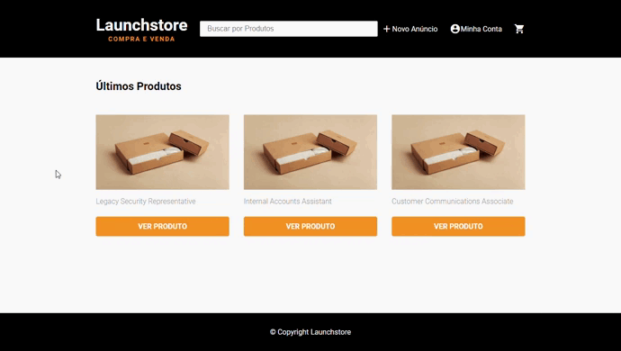

<div align="center">

# 

</div>

## 💻 Sobre o projeto

Launchstore é um e-commerce para compra e venda de produtos ou serviços.

## :rocket:  Tecnologias utilizadas
Esse projeto foi desenvolvido com as seguintes tecnologias:
- [HTML5](https://html.spec.whatwg.org/)
- [SASS](https://sass-lang.com/)
- [JavaScript](https://developer.mozilla.org/pt-BR/docs/Web/JavaScript)
- [NodeJS](https://nodejs.org/en/)
- [Nodemailer](https://nodemailer.com/about/)
- [Nunjucks](https://mozilla.github.io/nunjucks/)
- [Postgresql](https://www.postgresql.org/)
- [Express](https://expressjs.com/)
- [Express Session](https://github.com/expressjs/session)
- [Lottie](https://airbnb.design/lottie/)
- [Multer](https://github.com/expressjs/multer)
- [Faker](https://fakerjs.dev/)
- [BcryptJS](https://github.com/dcodeIO/bcrypt.js)


## :white_check_mark: Resultado


 
 
## 💾 Instalação

Baixe esse repositório e com o seu o terminal, entre no diretório


```
cd launchstore
```

Instale todas as dependências do projeto

```
npm install
```
 Crie o banco de dados e as tabelas utilizando os comandos inclusos no arquivo:

```
database.sql
```
Conexão com o banco de dados:
```
Abra e edite o arquivo "db.js" dentro da pasta "src/config"
Com o seu user e password do Postgres. Exemplo:
User: postgres
Password: root
```


Popule o banco de dados usando o aquivo "seed.js":

```
node seed.js
```

Rode a aplicação

```
npm start
```

Feito isso, abra o seu navegador e acesse `http://localhost:3000/`


## :metal: Como contribuir


- Faça um fork desse repositório;
- Cria uma branch com a sua feature: `git checkout -b minha-feature`;
- Faça commit das suas alterações: `git commit -m 'feat: Minha nova feature'`;
- Faça push para a sua branch: `git push origin minha-feature`.
- Status do Projeto: Concluido :heavy_check_mark:


Depois que o merge da sua pull request for feito, você pode deletar a sua branch.


## 📝 License

Esse projeto está sob a licença MIT. Veja o arquivo [LICENSE](LICENSE) para mais detalhes.

---
<h5 align="center">
    Feito com 🖤 ☕  by <a href="https://danielcrubens.github.io/" target="_blank">Daniel Rubens</a>
</h5>


